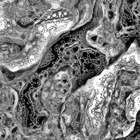
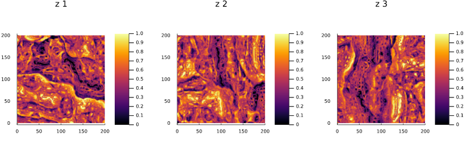

# Multi-Scale Turing Patterns

[![][travis-img]][travis-url] [![][codecov-img]][codecov-url]

A quick example:

```julia
using TuringPatterns

sz = (200, 200)

patterns = [
    SimplePattern(Params(2,   4,   0.01), sz),
    SimplePattern(Params(5,   10,  0.02), sz),
    SimplePattern(Params(10,  20,  0.03), sz),
    SimplePattern(Params(20,  40,  0.04), sz),
    SimplePattern(Params(50,  100, 0.05), sz),
]

saveframe(
    simulate(
        rand(sz...),    # initial conditions
        patterns,    # patterns
        BoxBlur(sz), # blur
        100          # iterations
    ),
    "picture.png"
)

# `open` on macOS or `xdg-open` on linux
run(`open picture.png`)
```

You should see something like this:



## Integration with GeoStats.jl

Multiple images can be generated using:

```julia
using GeoStats
using TuringPatterns
using Plots

# define simulation problem for a variable "z"
# request 3 realizations (i.e. images)
problem = SimulationProblem(RegularGrid{Float64}(200,200), :z => Float64, 3)

# solver with default parameters
solver = TuringPat()

solution = solve(problem, solver)

plot(solution)
```


## References

- [McCabe, J. Cyclic Symmetric Multi-Scale Turing Patterns](http://www.jonathanmccabe.com/Cyclic_Symmetric_Multi-Scale_Turing_Patterns.pdf)
- [Example gallery 1](https://www.flickr.com/photos/jonathanmccabe/sets/72157644907151060) and [Example gallery 2](https://www.flickr.com/photos/jonathanmccabe/sets/72157673446623356)

[travis-img]: https://travis-ci.org/yurivish/TuringPatterns.jl.svg?branch=master
[travis-url]: https://travis-ci.org/yurivish/TuringPatterns.jl

[codecov-img]: https://codecov.io/gh/yurivish/TuringPatterns.jl/branch/master/graph/badge.svg
[codecov-url]: https://codecov.io/gh/yurivish/TuringPatterns.jl
